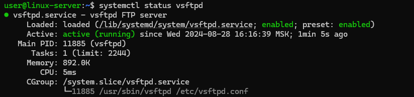

# How to Deploy an FTP Server on Debian 12

An FTP server is a type of server software that facilitates the transfer of files between a client and a server over a network using the File Transfer Protocol (FTP). It acts as a centralized storage location where users can upload, download, and manage files. In the guide, we will look at how to deploy an FTP server on Debian 12.

## How to Install FTP Server

The easiest way to deploy an FTP server on Debian is to install and set up `vsftpd` package, which is a popular and secure FTP server.

Update the package list before you start installing new software:
```
sudo apt update
```
Then install `vsftpd`:
```
sudo apt install vsftpd
```
After the installation is complete start the service:
```
sudo systemctl start vsftpd
```
And enable vsftpd to start on boot:
```
sudo systemctl enable vsftpd
```
To check the current status of the vsftpd service launch the command:
```
systemctl status vsftpd
```



Continued on the [iolloi.icu](https://iolloi.icu/index.php/2024/08/30/how-to-deploy-an-ftp-server-on-debian/)
